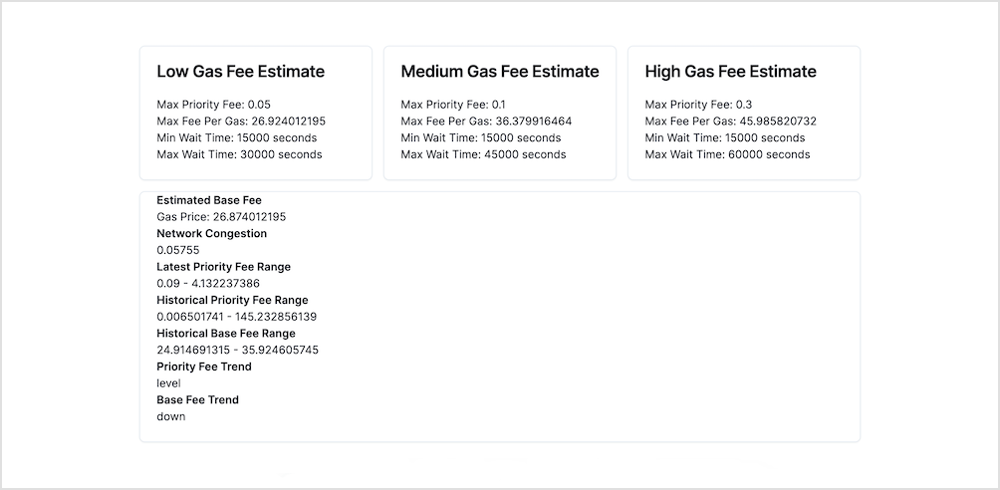

Just following this tutorial from **metamask**:  
👉 https://metamask.io/news/developers/how-to-build-a-simple-gas-tracker-app-with-gas-api-and-nextjs/

## Getting started

### Node script

Get gas prices in JSON.

(Have [bun](https://bun.sh/) installed globally)

```
bun admin/index.mjs
```

### Next.js app

```
npm i
```

Set both `INFURA_API_KEY` and `INFURA_API_KEY_SECRET` in a new `.env.local` file.

```
npm run dev
```



## Technical changes compared to tutorial

Using [ky](https://github.com/sindresorhus/ky) instead of axios for the http request within the node script.

Using [bun](https://bun.sh/) to run the node script instead of node directly.
 - Hence no need to use dotenv. (bun does that for us)
 - Hence no need to use something like [tsx](https://github.com/privatenumber/tsx) to understand TS. (bun does that for us)

Using [zod](https://github.com/colinhacks/zod) to parce process.env and have type-safe environment variables.
